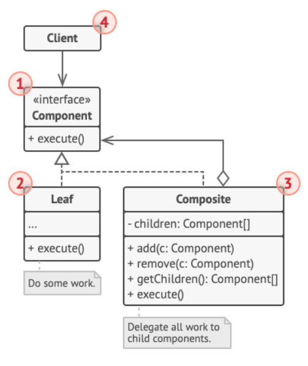

# (Some) Design Patterns in a Nutshell
### Remarks
* All resources are taken from [Refactoring Guru](https://refactoring.guru/).
* Here are briefly presented some design patterns. Click on the name for each pattern for more details :D 

## Creational Patterns
### [Abstract Factory](CreationalPatterns/AbstractFactory/Description.md)
* When?
  - several variants of related objects
* Example:
  - related objects: Checkboxes & Buttons
  - variants: Buttons & Checkboxes for **Windows** and **Mac**
* How?
  - We are going to have an abstract factory (GUI) and 2 concrete factories (Win & Mac). 
  - We also need 2 interfaces for the objects (Button & Checkbox).
  - Each concrete factory is **responsible to create** objects which implement Button and Checkbox.

  

### [Factory Method](CreationalPatterns/FactoryMethod/Description.md)
* When?
  - when you want to extend an application by creating new types of objects without breaking the actual code
* How?
  - by replacing direct object construction calls with calls to a specific factory method
* Example:
  - We have a Windows Dialog class that **creates** a button; we already have a Windows Button .
  - What if we want to add a new HTML Button?
  - We need to have an abstract class/interface Dialog and 2 subclasses responsible for creating the two type of buttons
    - it means we are going to have factory methods defined in Windows Dialog & Web Dialog
  
  

### [Builder](CreationalPatterns/Builder/Description.md)
* When?
  - when you have an object with multiple fields to initialize 
  - you might not want to use a constructor -> call for constructor could become way too long!
* How?
  - construction code is extracted in a separate class
  - this way we can have objects that differ in some fields (so we don't have to add additional fields for other objects)
    - for example for some houses you need to build a pool :D, you don't need a "pool" field for others
* Example:
  - we have to build cars; we need to set seats, set engine etc.
  - but we have 2 types of cars: autonomous cars and manual cars
  - each type need a builder; for both of them you need to set Seats, but autonomous cars need a GPS while manual ones don't
  - we need two 2 builders, Autonomous Car builder and Manual Car Builder that implement Builder interface
  - also, we can have a Director that define the order in which to call constructions calls
  
  

 

## Structural Patterns
### [Adapter](structuralPatterns/adapter/Description.md)
* When?
 - when you have two objects that cannot communicate
* How?
 - adapter is a special object that converts the interface of one object so that another can understand it
* Example:
  - we have a round hole and 2 type of pegs: squared and round
  - we need to verify if the pegs fits the round hole 
  - since the shapes of pegs is different and RoundHole communicates directly with RoundPeg, we need an adapter for SquarePeg
  - the adapter is used to check if the square can be circumscribed in a circle 
  - in other words, we transform the squared peg into a round one
  
  

### [Composite](structuralPatterns/composite/Description.md)
* When?
 - for example, we have a Box object which contain Products and smaller boxes
 - the smaller boxes can also contain smaller boxes and objects
 - so we have a hierarchy or a tree structure
* How/What?
 - Composite pattern allows you to compose objects into tree structures
 - you can work with them as individual objects
 - Structure:
   - Component ->  interface that describes the common fields/methods for both simple and complex objects
   - Leaf -> simple object
   - Container(composite) -> complex object (it contains leaves or other containers)
* Example:
 - a circle contains several points
 - the points can be considered as leaves

 

### [Decorator](structuralPatterns/decorator/Description.md)
* When?
 - when you want to attack new behaviors to objects by placing them into wrappers
* Elements :
 - Component -> common interface for wrappers
 - Concrete Component -> class with wrapped objects
 - Base Decorator -> class with a field that reference the wrapped object
 - Concrete Decorator -> defines extra behaviors that can be added to components
* Example:
 - we have a DataSource interface
 - data can be provided in different ways:
   - human readable data
   - machine readable data  --> here Decorator patterns can be used
     - we can have encrypted or compressed data
     - both of these can be considered Decorators

 

 

## Behavioral Patterns
### [Command](behavioralPatterns/Command/Description.md)
* When?
  - when you need to parametrize objects with operations
* How?
  - turns a request into a stand-alone object that contains all information about the request
  - you can pass the request as a method argument
* Elements:
  - Sender / invoker -> responsable for initiating requests
  - Command -> interface where you will find a (single) method for executing commands
  - Concrete Commands -> implement requests
  - Receiver -> class with business logic
* Example:
  - you have an application with an editor able to do various tasks
  - we will need a Command interface and CopyCommand,PasteCommand,etc. as concrete commands
  - Editor class will be the Receiver
  
 

### [Observer](behavioralPatterns/observer/Description.md)
* When?
 - when changes to the state of one object may require changing other objects
 - when you need to define a subscription mechanism to notify multiple objects about an event that happened to an object they are observing
* How?
 - by adding mechanism to a class called Publisher so individual objects can (un)subscribe from a stream of events coming from the publisher
* Elements:
  - Publisher -> transmits events of interest for other objects
  - Subscriber -> interface where you declare notifications (**update** method)
  - Concrete subscribers -> perform actions in response to notifications received from publisher
* Example:
  - we want to be notified every time we modify a file 
  - EventManager class will be the publisher - it's responsible for notify the subscribers
  - we can receive the notification either by Logs or by Email Alerts -> those two are the concrete subscribers
  
  

### [Strategy](behavioralPatterns/strategy/Description.md)
* When?
  - when you want to use different variants of an algorithm within an object
  - you are able to switch from one to another **during runtime**
* How?
  - "break" a class that does something specific in different ways and extract all of these algorithms into separate classes(strategies)
* Elements:
  - Context -> maintains a reference to a concrete strategy 
  - Strategy -> common interface to all concrete strategies
  - Concrete strategies -> implement variations of an algorithm 
* Example:
  - Context = Order : you order something online .. how will you pay for that item?
  - Strategy = PayStrategy : interface implemented by Pay By Credit Cart / Pay By PayPal
  - both are strategies that implement different versions for the same algorithm
 
  

